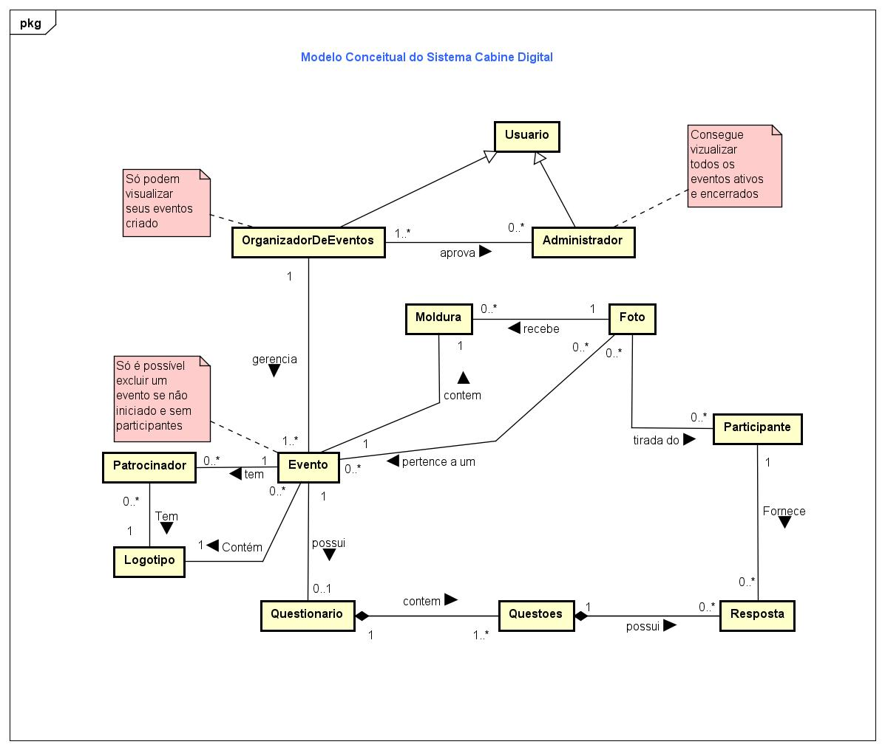
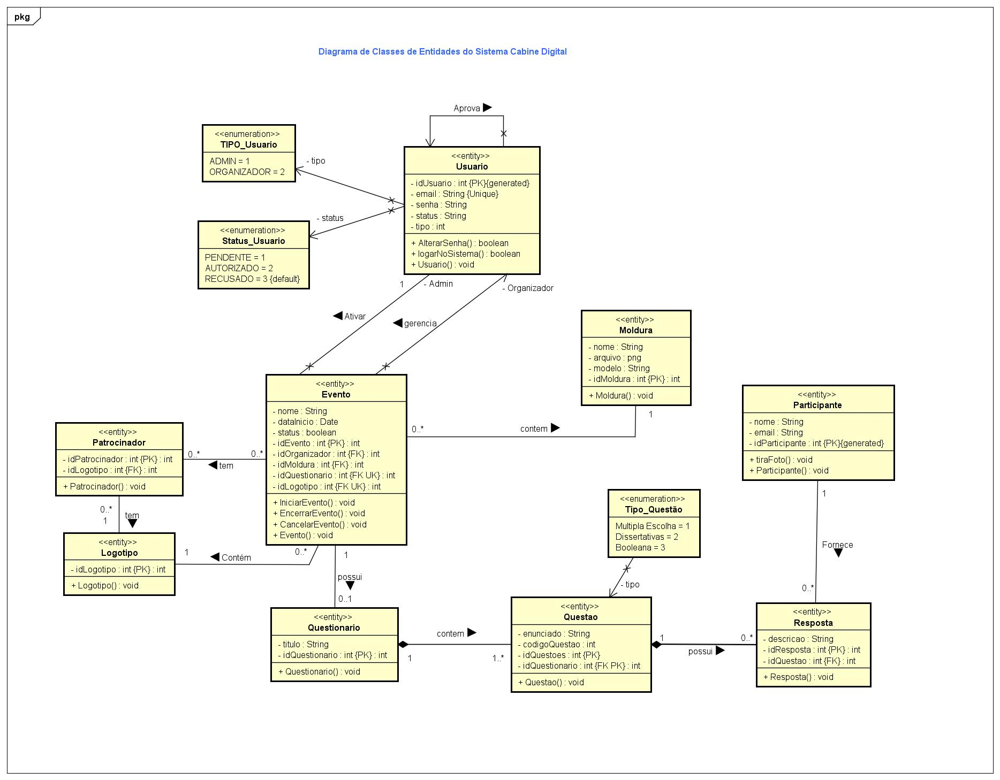
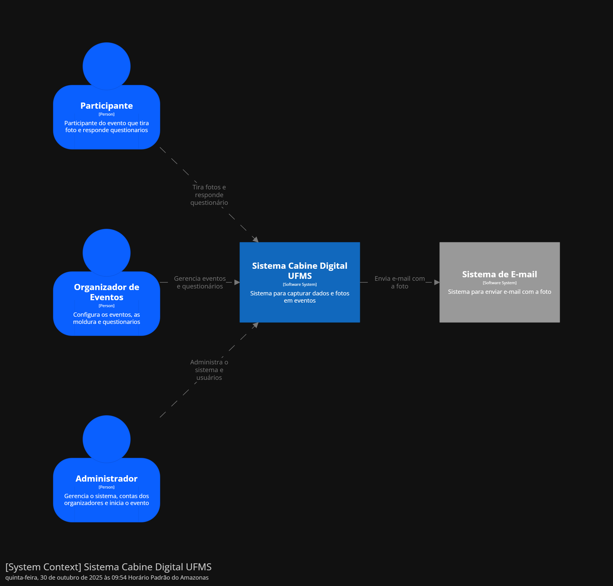
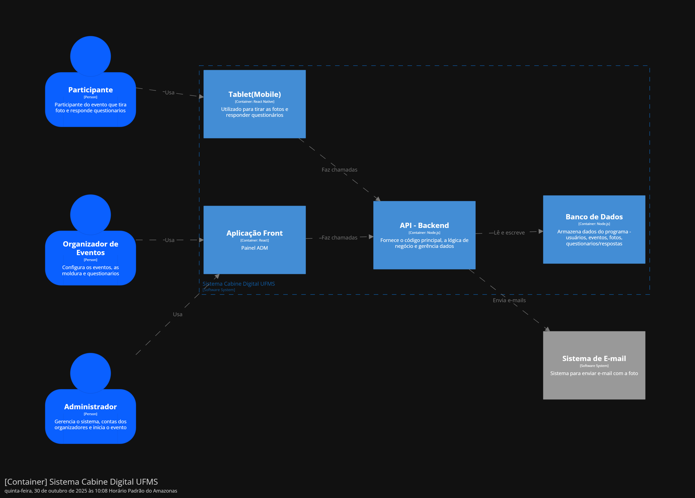

# UFMS_ArquiteturaDeSoftware_CabineDigital
Diagramas e artefatos de modelagem do sistema "Cabine Digital UFMS" realizados ao longo da disciplina Arquitetura de Software.

* **Faculdade:** UFMS
* **Curso:** Engenharia de Software
* **Ferramentas:**
  - Astah
  - draw.io;
 
### Descrição:

 
### Modelagem:
 * #### **Diagrama Conceitual**
 <!--* ;-->

  

* #### **Diagrama Classes de Entidade**
 <!--* ;-->

  

### **C4**
* #### **Diagrama Contexto**

  

  <!-- [Documento Script SQL](./universidade.sql) -->
  
* #### **Diagrama Container**

  

  
⚠ **Atenção**: Material com fins de aprendizado, e assim sendo, pode conter **erros** e **insconsistências**.

* ### **Links e material de apoio** 📖
 - [Modelo Conceitual](https://fernandommota.github.io/academy/disciplines/2015/analise_projeto_software/files/08_modelo_conceitual.pdf)
 - [Diagrama de Classes](https://deinf.ufma.br/~geraldo/dob/7.Classes.pdf)
 
    

